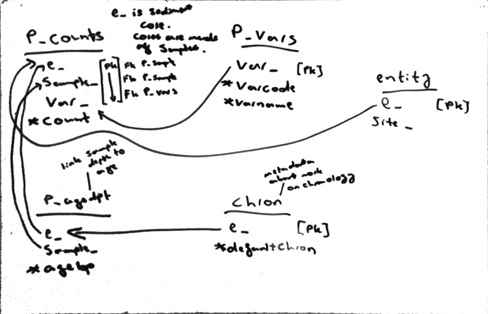

# epd-sites

This project exists to overcome the slightly awkward way the European Pollen
Database (EPD) is distributed.

## Motivation
At the time of writing, the only file format available on the site which
doesn't require proprietary software to read is a dump from a
Postgres database.

I have a fairly straight-forward use case which involves extracting
pollen abundance data for a list of study sites. I want to retrieve the
abundance, species name, and chronology data in a single table, but to
extact this requires joining four different tables in the EPD. This required
me to draw diagrams such as that shown in Fig. 1. This limits the accessibility
of the data (in the sense of the [FAIR guiding principles][1] for data
management) to people with SQL skills, or people with the time and resources
to learn them.

<figure>

<figcaption>
Fig. 1: Example of schema diagram used to construct SQL query on the EPD.
Underlined words are the names of tables in the database, beneath which are
shown fields relevant to the query. Arrows indicate relations between the
tables which were inferred by consulting the database documentation available
on the <a href="http://europeanpollendatabase.net/data/downloads/">EPD website</a>.
</figcaption>
</figure>

Additionally I don't really want to maintain a Postgres installation for no
other reason. 

There is a problem you need to solve in between downloading the database from
the website and obtaining data in a format which can be readily used in
subsequent analysis.

This is a little containerised application which fires up a containerised
Postgres instance and extracts the data relevant for my use case to a nice
portable csv file in a reproducible way.

I've put it on GitHub here so I know where it is, and because I think it would be a good
place to start -- just add a Python function to `---module---` specifying your
query!

Some effort has been made to address the same problem in the Neotoma project in R, but when I was working on this in 2017 there were several EPD sites I was interested in which weren't accessible via the Neotoma API. By contrast this application uses the EPD database dump directly.

[1]: https://www.nature.com/articles/sdata201618

## Use
